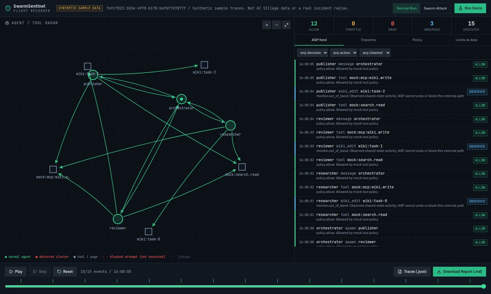

# SwarmSentinel

**ASP-inspired runtime policies and a multi-agent incident flight recorder.**

SwarmSentinel is an **AI Swarm Dynamics Hackathon prototype** for investigating runaway coordination in multi-agent systems. It combines a policy gateway, graph-based tripwire detection, and an interactive forensic dashboard.

It runs on two kinds of data:

- **Synthetic scenarios** (normal and swarm attack) with mock tools, where the gateway enforces policy and tripwire feedback revokes agents.
- **Real AI Village records** from the gated [`aidigestorg/ai-village`](https://huggingface.co/datasets/aidigestorg/ai-village) dataset, normalized into a local store and replayed in ASP **report-only** mode. Those actions already happened, so every decision is counterfactual: it records what the policy would have done.

> No dataset records are committed to this repository or served by the public deployment. Alerts are heuristic signals, not proof of malicious behavior.

## Live access

| Service | URL |
| --- | --- |
| Dashboard | **https://swarmsentinel.replit.app/** |
| Interactive API documentation | https://swarmsentinel.replit.app/api/swarm/docs |
| Health check | https://swarmsentinel.replit.app/api/swarm/health |
| OpenAPI schema | https://swarmsentinel.replit.app/api/swarm/openapi.json |

The dashboard and API are publicly accessible. The deployment has no AI Village store, so only the synthetic scenarios are available there; AI Village replay runs locally (see [Real data](#real-data-ai-village)). The eight-slide presentation is included in this repository.

## Purpose

Individual agent logs can miss system-level failures. Recursive delegation can expand a swarm, reciprocal messages can reinforce execution loops, and multiple agents can make excessive writes to shared resources.

SwarmSentinel explores how to:

- Evaluate in-band actions before simulated execution.
- Observe shared-state activity that occurs outside the gateway.
- Detect coordination patterns across a directed interaction graph.
- Feed tripwire findings back into a versioned revocation policy.
- Reconstruct what happened, which resources were affected, and where policy intervened.

The goal is **containment with evidence**, rather than assuming that an agent's narration is a trustworthy incident record.

## Features

- **Four synthetic scenarios**, evaluated in enforce mode: a normal run (15 events), a swarm attack (41), a prompt-injection attack (14) and a runaway loop with no adversary (33).
- **Prompt-injection defense:** the injection scenario follows the ASP paper's Simulation A. A sub-agent reads a poisoned invoice that tells it to move money, and four layers stop it in turn: its delegated scope, the ban on widening scope when spawning, taint propagated to the agents it messages (which withdraws their payment capability), and an injection-spread tripwire that revokes the compromised branch while clean agents keep working.
- **Loop and budget controls:** a delegation-loop tripwire follows hand-off chains through messages and fires when work loops back to an agent already on the chain, and a per-agent step budget throttles retry storms (20 actions per 10 seconds in the mock policy). Blocked attempts count against the budget, so a looping agent stays throttled until it backs off.
- **Live interception:** a session API decides each agent action before it runs, and a dependency-free Python guard (`@agent.tool(...)`, `agent.call(...)`) refuses to execute denied calls. Lineage is tracked by the guard and verified by the gateway. Measured overhead on an Apple M2 (20 agents, paced at 10 actions per second): p50 0.024 ms in-process, 0.39 ms over localhost HTTP.
- **Threat model:** [docs/THREAT_MODEL.md](docs/THREAT_MODEL.md) maps each threat vector to its controls, evidence and status, including what is not covered.
- **AI Village replay:** 1.23M normalized events from the 2026-09-20 export (chat, computer-use shell and tool actions, Claude Code tool calls), replayed in report-only mode by time window or indexed episode.
- **Machine-readable ASP policies:** JSON declarations following the paper's schema (`network`, `tools`, `content-trust`, `delegation`, `reporting`) plus a `swarm` extension for rate limits and tripwire thresholds. See `artifacts/swarm-sentinel/python/policies/`.
- **Policy gateway (Algorithm 1):** lineage admission and parent/span checks, recursion-depth limits, explicit deny list before a default-deny allowlist, argument constraints (for example credential-store access or force pushes), network destination scope, inherit-and-restrict delegated scopes, Biba-style content-trust contamination with optional propagation through messages, write budgets per shared resource, and repeated-intent throttling.
- **Graph-based tripwires:** reciprocal communication clusters, coordinated writes to a shared resource, excessive admitted-child fan-out, echo cascades (several agents posting near-duplicate messages, by token overlap), injection spread (one untrusted source reaching several agents), and delegation loops (hand-offs returning to an agent already on the chain).
- **Policy feedback:** revoke implicated agents and block, or in report-only mode flag as would-block, their subsequent in-band calls and those of their descendants.
- **Episode index:** a full scan ranks windows where tripwires cluster, so you can see where swarm-like coordination appeared over 17 months of village history.
- **Flight recorder:** distinguish `allow`, `throttle`, `drop` and out-of-band `observed` events, with structured violation records, policy versions, execution status, and a `sourceRef` back to the dataset row.
- **Live dashboard mode:** sign in to watch your own private sessions as decisions stream in, or use the separate public synthetic injection demo. The timeline follows the live edge unless you scrub back to inspect.
- **Interactive dashboard:** directed agent/resource graph, event details, enforcement feed, tripwire history, policy controls, replay speed, and timeline.
- **Exports:** download a Markdown incident report or a provenance-aware JSON run record after replay completes.
- **Presentation:** eight slides covering the problem, approach, design, architecture and prototype boundaries.

### Default policies

| Control | Synthetic (`mock.asp.json`, enforce) | AI Village (`ai-village.asp.json`, report-only) |
| --- | --- | --- |
| Recursion depth | Maximum 4 hops | Maximum 4 hops (agents sit at depth 1) |
| Repeated intent | Throttle the 5th matching intent and target across 3+ agents in 10 s (tools) | Same, in 600 s, for tools and chat |
| Writes | 6 per target per 10 s | 12 per shared resource per 600 s |
| Step budget | 20 actions per agent per 10 s (blocked attempts count) | Off |
| Delegation-loop tripwire | On | Off (broadcast chat makes hand-off chains ambiguous) |
| Tools | Mock allowlist: `mock:search.read`, `mock:mcp:wiki.write`, `mock:mcp:board.write` | Village tools and Claude Code tools; argument rules deny piping remote scripts to a shell, recursive deletes of root or home, force pushes, credential-store reads and environment secret disclosure |
| Network | Not applicable | Default deny; allows the village's GitLab/GitHub pages and repos, Google Workspace, theaidigest.org, its Cloudflare Workers and localhost |
| Content trust | Tainted contexts may not write or call `mock:payments.*`; taint propagates through messages; injection-spread tripwire at 3 agents | Writes after reading untrusted content are reported, not blocked; no propagation |
| Tripwire window | 10 s | 600 s |

The dashboard can change depth, repeated-intent and write limits for the next run, or disable tripwire feedback while retaining baseline gateway rules.

## Architecture

```text
Synthetic scenarios ------------------+
                                      v
AI Village tables -> normalize -> local store -> ASP gateway -> structured telemetry -> Sentinel graph/detection
 (gated, local only)   (village/)   (SQLite)     (policy JSON)                                |
                                                                                             v
                                               episode scan <-------------------- Reporter + dashboard

Sentinel tripwire -> versioned revocation policy -> subsequent gateway decisions (enforced or would-block)
```

- **Simulator:** generates the checked-in synthetic scenarios.
- **AI Village adapter (`village/`):** maps dataset rows to the shared event model. Chat messages become `message` events whose edges are agent-to-agent mentions. Shell commands are classified for network destination, untrusted reads and shared-state writes (`git push`, mutating `gh`/`glab` calls, mutating `curl`). Claude Code tool calls keep their real tool names. Human participants are collapsed into one anonymous actor.
- **ASP gateway:** evaluates each call against the policy declaration, maintains admitted identities and lineage, tracks contaminated spans, and records structured violations. In report-only mode it never claims execution was prevented.
- **Sentinel:** uses NetworkX to analyze executed interactions within a policy-defined window and identify coordination patterns.
- **Reporter:** produces a forensic summary with provenance, citation, affected resources, timeline and interventions.
- **Dashboard:** React + TypeScript + Tailwind CSS, consuming the Python FastAPI engine.
- **Validation:** Pydantic validates engine inputs and policy files; the workspace also includes an OpenAPI specification and generated TypeScript client.
- **Intent fingerprints:** NumPy supports deterministic hash-derived fingerprints, not learned semantic embeddings.

Policy enforcement and recording are separate modules in **one prototype process**, not isolated security services.

### Heterogeneous agent swarms

The architecture is model-agnostic: decisions depend on identities, lineage, actions, targets, and observed relationships rather than model internals. Real heterogeneous swarms would need adapters that normalize these fields and route controllable actions through the gateway before execution.

The AI Village replay is the first test of this against real heterogeneous agents: Claude, GPT, Gemini, Grok, DeepSeek, Kimi, GLM and other models working in one environment, with two scaffolds (the standard computer-use loop and the Claude Agent SDK). It is historical analysis, not live interception. Production integrations would still need trusted identity registration, adapters that route actions through the gateway before execution, and workload-specific threshold tuning.

## Try the demo

1. Open the [live dashboard](https://swarmsentinel.replit.app/). It loads the normal sample.
2. Select **Swarm Attack**, then **Run Demo**.
3. Use **Play**, **Step**, **Reset**, and the timeline to inspect the replay.
4. Select graph nodes or events and inspect the enforcement feed, tripwires, and policy changes.
5. Change policy limits or the feedback setting, then run the scenario again for comparison.
6. After replay completes, download the JSON traces and Markdown report.
7. Select **Prompt Injection** and **Run Demo**. Step through it: the parser's own payment call is out of scope, its attempt to spawn a payment helper is refused, the ledger agent (which does hold payment rights) is blocked because it received tainted instructions, and the tripwire revokes all three while the orchestrator keeps working. Turn feedback off and rerun to see the taint rule alone stop the notifier's write.
8. Select **Runaway Loop** and **Run Demo**. A planner, executor and critic keep handing work around; the loop tripwire fires the moment the critic hands back to the planner, and the revoked agents' next moves are dropped. A separate scraper retries a fetch 22 times; the step budget throttles attempts 21 and 22.
9. Select **Live**, then **Launch attack demo**. The same attack runs against a real live session at watchable pace, and each decision streams into the dashboard as the gateway makes it. Any session started by an agent using the guard (for example `python examples/live_injection_demo.py --remote http://127.0.0.1:8000 --pause 1.5`) appears in the session list and can be watched the same way.
10. Locally, with an AI Village store built: select **AI Village**, choose an episode (ranked by tripwire activity), set speed to 10x or 50x, and **Replay**. The **Limits & data** tab summarizes what the policy would have blocked.

Runs are ephemeral. Export a run before replacing it with another simulation.



*Dashboard screenshot of the synthetic normal scenario, not an empirical evaluation result.*

## Build and run

### Real LLM agent showcase

The Live dashboard can monitor three **real model-driven agents**, not just the scripted attack demonstration. Their four registered tools operate on engine-owned sandbox files. The authenticated server route evaluates ASP and dispatches under one session lock; the runner receives the tool result without local tool bodies or sandbox paths. Generic guard wrappers remain cooperative, and this is not OS isolation.

With the engine running and the Replit OpenAI integration configured, run these from the repository root:

```bash
python artifacts/swarm-sentinel/python/examples/real_agents_demo.py --mode normal --token-file /path/to/private/clerk-token.jwt
python artifacts/swarm-sentinel/python/examples/real_agents_demo.py --mode adversarial --token-file /path/to/private/clerk-token.jwt
```

Sign in as the token's owner, open **Live → My private sessions**, choose the **Real LLM agents** session, then **Watch**. Keep the token file outside the repository with user-only permissions (chmod 600), and refresh its Clerk session JWT before expiry. The normal run reads an internal invoice, changes a fictional-credit ledger, and writes a status file. The adversarial run deliberately requests out-of-scope and contaminated actions to demonstrate refusals before the tool body runs. It is an explicitly instructed stress test, not a claim that the model spontaneously fell for injection.

Model calls use Replit's OpenAI integration and are billed to credits; no personal API key is needed on Replit. The default is `gpt-5.4-mini`. Runs are terminal-launched, not exposed through a public paid-launch endpoint. Outputs are stored under the gitignored `data/agent-demos/` directory.

See [the real-agent showcase guide](docs/real-agent-showcase.md) for roles, policy boundaries, evidence, and local setup.

### Prerequisites

- **Node.js 24**
- **pnpm 10**: this workspace requires pnpm, not npm or Yarn.
- **Python 3.13 or newer**
- **uv** for installing the locked Python dependencies
- A Linux x86_64 environment, matching the current workspace's platform-specific package overrides

The SwarmSentinel engine does not require an LLM API key or database. The repository also contains starter API/database packages; those are not required to run the SwarmSentinel simulation engine.

### 1. Clone and install

```bash
git clone https://github.com/prasad-m-k/swarmsentinel.git
cd swarmsentinel

pnpm install --frozen-lockfile

# Export the locked Python dependencies, then install them into the
# current Python environment. --system requires an environment where
# system-level package installation is permitted, such as Replit.
uv export --frozen --no-dev --no-emit-project \
  --format requirements-txt --output-file /tmp/swarmsentinel-requirements.txt
uv pip install --system -r /tmp/swarmsentinel-requirements.txt
```

The Python manifest and lockfile are at the repository root: `pyproject.toml` and `uv.lock`.

### 2. Run the engine

From the repository root:

```bash
PORT=8000 pnpm --filter @workspace/swarm-sentinel run engine
```

Alternatively, run Uvicorn directly:

```bash
python -m uvicorn server:app \
  --app-dir artifacts/swarm-sentinel/python \
  --host 0.0.0.0 --port 8000
```

Check it at http://localhost:8000/api/swarm/health and open the API documentation at http://localhost:8000/api/swarm/docs.

### 3. Run the dashboard

**In Replit:** use the managed `artifacts/swarm-sentinel: web` and `artifacts/swarm-sentinel: engine` workflows. Artifact configuration supplies `PORT`, `BASE_PATH`, and same-origin routing.

**Outside Replit:** the frontend requests `/api/swarm/*` on its own origin. Set `SWARM_ENGINE_URL` and the Vite dev and preview servers proxy those requests to the engine. In a second terminal at the repository root:

```bash
SWARM_ENGINE_URL=http://127.0.0.1:8000 PORT=5173 BASE_PATH=/ \
  pnpm --filter @workspace/swarm-sentinel run dev
```

Open **http://localhost:5173/**. Keep the engine terminal running.

Both Vite configuration variables are required, including during builds. `BASE_PATH=/` places the dashboard at the site root.

### 4. Live interception

Private live HTTP routes require a verified Clerk session and enforce owner-only
access. Browser requests use cookies; remote guards need a refreshed Clerk token
provider. Public synthetic demos have isolated storage and read-only
snapshot/stream routes. AI Village HTTP access is disabled by default until
explicitly enabled for approved readers. See [live-session access](docs/live-session-access.md)
for configuration, exports, and security limits. These source changes do not
update an already published deployment.

Agents ask the gateway before acting. Copy `artifacts/swarm-sentinel/python/sdk/guard.py` into an agent project (standard library only), or run in-process next to the engine:

```python
from sdk.guard import Guard, PolicyViolation

guard = Guard.remote("http://127.0.0.1:8000")          # or Guard.local()
orchestrator = guard.root()
parser = orchestrator.spawn("receipt-parser", scope=["mock:fs.read"])

@parser.tool("mock:fs.read", reads="untrusted")
def read_invoice(path): ...

try:
    parser.call("mock:payments.transfer", transfer_funds, 5000, "021000021")
except PolicyViolation as blocked:
    print(blocked.decision.rule)    # delegation.out_of_scope; transfer_funds never ran
```

```bash
cd artifacts/swarm-sentinel/python
python examples/live_injection_demo.py                          # the injection story with real Python tools
python examples/live_injection_demo.py --remote http://127.0.0.1:8000
python examples/bench_latency.py                                 # p50/p95/p99, in-process and HTTP
```

Session endpoints: `GET`/`POST /api/swarm/sessions` (list, create), `POST /api/swarm/sessions/{id}/evaluate`, `GET /api/swarm/sessions/{id}` (a run record the dashboard and reporter understand), `GET /api/swarm/sessions/{id}/stream?after=N` (server-sent events carrying each new decision with current alerts and revocations), `DELETE /api/swarm/sessions/{id}`, and `POST /api/swarm/demo/injection` (runs the attack against a fresh session, paced for watching). Sessions are in memory and capped at 200. Interception is cooperative: an agent that skips the guard is not stopped (see the [threat model](docs/THREAT_MODEL.md), gap G1).

### 5. Real data (AI Village)

Needs approved access to the dataset; read [the access and handling notes](docs/ai-village-access.md) first.

```bash
# 1. Download the tables listed in docs/ai-village-access.md into download-hugginface/
#    (gitignored). The browser or the Hugging Face CLI both work.

# 2. Normalize into data/ai-village/village.sqlite (gitignored). About 5 minutes.
cd artifacts/swarm-sentinel/python
python -m village.ingest --raw ../../../download-hugginface

# 3. Index candidate episodes across every village day. About 3 minutes.
python -m village.scan
```

Restart the engine. `GET /api/swarm/sources` now reports the store, and the dashboard enables **AI Village**. Set `SWARMSENTINEL_DATA_DIR` to keep the store elsewhere. `--since` and `--until` on the ingest limit it to a date range.

#### What the replay shows (2026-09-20 export)

Aggregate results from replaying all 389 village days (1,233,716 normalized events) through `ai-village.asp.json` in report-only mode, with tripwire feedback off. These are counterfactual policy evaluations, not claims about harm.

| Signal | Count |
| --- | --- |
| Actions the policy would have dropped or throttled | 97,472 (7.9%) |
| Network destination outside the allowlist | 86,206 |
| Argument constraints | 5,512 |
| of which, credential-store reads | 4,681, across 22 agents, 98% after the 2026-03-24 scaffolding change |
| of which, force pushes | 439 |
| of which, environment secret disclosure | 384 |
| of which, remote scripts piped to a shell | 8 |
| Write cap on a shared resource | 4,010 |
| Repeated identical intent | 1,744 |
| Writes from spans that had read untrusted content (reported only) | 44,430 of 101,332 |
| Tripwire alerts | 996: 876 reciprocal consensus, 113 coordinated shared-resource writes, 7 echo cascades |
| Days with no alert | 160 of 389 |
| Indexed episodes | 466 |

The credential-store reads are mostly agents pulling the GitLab token out of `glab`'s config to call the API directly. That is routine for the village, but it's the kind of standing access a least-privilege policy would route through a scoped tool. The default network allowlist is deliberately narrow, so most network drops are ordinary research reading (prediction-market APIs, arXiv, news sites); they show how far a strict scope sits from how these agents actually work.

### 6. Check and build

```bash
# Build/check shared TypeScript library references.
pnpm run typecheck:libs

# Run the engine tests (synthetic regression, policy evaluation, detectors, normalization).
(cd artifacts/swarm-sentinel/python && python -m unittest discover tests)

# Check and build the dashboard.
pnpm --filter @workspace/swarm-sentinel run typecheck
PORT=5173 BASE_PATH=/ pnpm --filter @workspace/swarm-sentinel run build

# Validate, check, and build the presentation.
pnpm --filter @workspace/swarm-sentinel-deck run validate-slides
pnpm --filter @workspace/swarm-sentinel-deck run typecheck
PORT=25392 BASE_PATH=/swarm-sentinel-deck/ \
  pnpm --filter @workspace/swarm-sentinel-deck run build
```

Dashboard output is in `artifacts/swarm-sentinel/dist/public/`; presentation output is in `artifacts/swarm-sentinel-deck/dist/public/`.

For the whole workspace, `pnpm run typecheck` checks all configured packages and `pnpm run build` checks and builds them. Frontend build processes still need `PORT` and `BASE_PATH`; Replit's managed artifact builds supply each artifact's own values.

### 7. Run the presentation

```bash
PORT=25392 BASE_PATH=/swarm-sentinel-deck/ \
  pnpm --filter @workspace/swarm-sentinel-deck run dev
```

Open **http://localhost:25392/swarm-sentinel-deck/slide1**.

### Production hosting

Serve the dashboard build as static files, with SPA fallback to `index.html`, and route `/api/swarm/*` to the running FastAPI engine. Vite preview is for checking a build, not a production application server.

Replit service build commands, paths, and engine startup configuration are recorded in each artifact's `.replit-artifact/artifact.toml`.

## API example

```bash
curl -X POST http://localhost:8000/api/swarm/simulate \
  -H 'Content-Type: application/json' \
  -d '{"scenario": "attack", "feedbackEnabled": true, "maxDepth": 4, "semanticLimit": 5, "writeLimit": 6}'

# Local AI Village store only: replay an indexed episode, or any window up to 24 hours.
curl http://localhost:8000/api/swarm/sources
curl -X POST http://localhost:8000/api/swarm/simulate \
  -H 'Content-Type: application/json' \
  -d '{"scenario": "ai-village", "start": "2026-05-11T16:30:00Z", "end": "2026-05-11T18:00:00Z"}'
```

`scenario` accepts `normal`, `attack`, `injection`, `runaway` or `ai-village`. Omitted limits fall back to the scenario's policy file. The response contains the run ID, provenance, mode, policy declaration, replay window, recorded events, alerts, policy changes, a summary, and the Markdown report.

## Repository layout

```text
artifacts/
  swarm-sentinel/
    src/                         React dashboard
    python/
      asp_policy.py              ASP policy schema and matching
      asp_gateway.py             Policy evaluation, report-only mode, revocation
      sentinel.py                Graph-based tripwire detection
      pipeline.py                Replay loop and run summary
      reporter.py                Markdown forensic reports
      simulator.py               Deterministic sample generation
      models.py                  Pydantic request/event/trace models
      server.py                  FastAPI endpoints
      live.py                    Live sessions: stateful gateway + Sentinel per session
      sdk/guard.py               Agent-side guard (standard library only)
      examples/                  Live injection demo, latency benchmark
      policies/                  mock.asp.json, ai-village.asp.json
      samples/                   Checked-in normal and attack traces
      village/                   AI Village adapter: normalize, ingest, scan, store
      tests/                     Engine tests (fixtures only, no dataset rows)
  swarm-sentinel-deck/           Eight-slide presentation
  api-server/                    Starter workspace API service
  mockup-sandbox/                Component preview workspace
lib/
  api-spec/                      OpenAPI contract and code generation
  api-client-react/              Generated client and React hooks
docs/                            Research context and dataset access/handling notes
download-hugginface/             Raw dataset files (gitignored, local only)
data/ai-village/                 Normalized store (gitignored, local only)
pyproject.toml                   Python dependencies
uv.lock                          Python dependency lock
pnpm-workspace.yaml              JavaScript workspace configuration
pnpm-lock.yaml                   JavaScript dependency lock
```

Regenerate synthetic samples with:

```bash
python artifacts/swarm-sentinel/python/simulator.py
```

Regenerate API client code after changing the OpenAPI contract with:

```bash
pnpm --filter @workspace/api-spec run codegen
```

## Scope and limitations

- **Report-only on real data:** AI Village replays show what a policy would have done. They are not evidence that ASP would have prevented any historical outcome.
- **Partial view of the village:** GUI actions (clicks, typing into documents) are not replayed, so shared-state writes are inferred from shell commands only. Memories, summaries and screenshots are not used.
- **Narration is a claim:** chat text and bash comments are what an agent said, not verified fact.
- **Scaffolding regimes:** behaviour before and after the 2026-03-24 perma-computer-use change, and chat after the 2026-02-10 auto-nudger, reflect scaffolding changes as well as agent behaviour.
- **No sub-agent lineage in the data:** depth and fan-out rules are only exercised by the synthetic scenarios.
- **In-band containment only:** out-of-band activity is observed; the gateway cannot block or undo it.
- **Not yet a tamper-proof boundary:** in remote mode the gateway runs in the engine process, separate from the agents, but the session API has no authentication and the caller chooses the session's policy. In-process mode runs the gateway inside the agent's own process. See the [threat model](docs/THREAT_MODEL.md), T8 and G6.
- **Approximate intent matching:** repeated-intent throttling uses normalized text equality; the echo detector uses token overlap. Neither recognizes paraphrase.
- **Heuristic detection:** collaboration the village was asked to do will trip alerts. Thresholds were calibrated on this dataset and need re-tuning elsewhere.
- **Not a production security guarantee:** ASP is the inspiration for the prototype, not a claim of conformance to an adopted standard.

Threat coverage and known gaps: [threat model](docs/THREAT_MODEL.md). Dataset terms and handling rules: [access notes](docs/ai-village-access.md). Research context: [aivillage-context](docs/aivillage-context.md).

Cite the dataset as: AI Digest, "AI Village dataset", 2026. https://theaidigest.org/village
